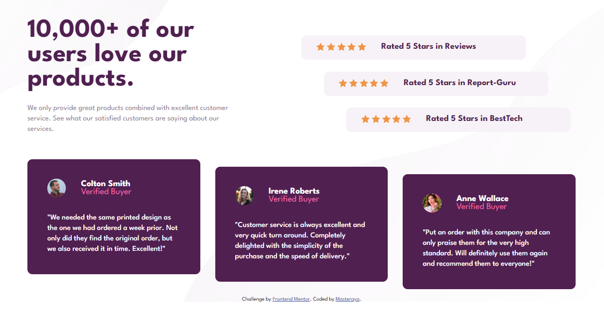
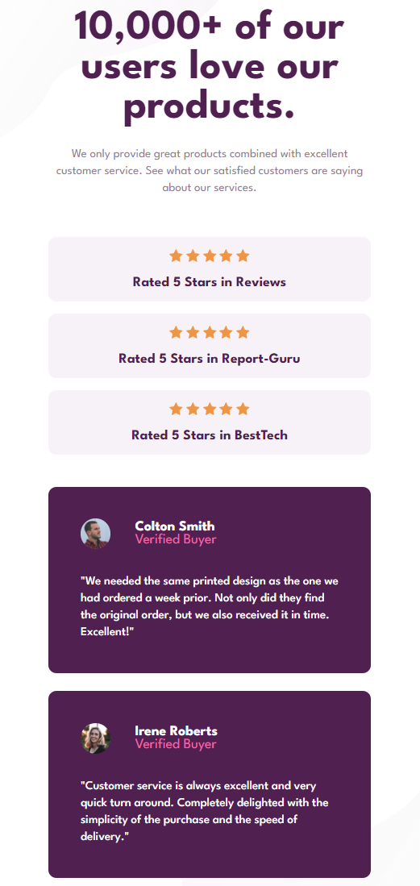

# Frontend Mentor - Social proof section master

This is a solution to the [Social proof section challenge](https://www.frontendmentor.io/challenges/social-proof-section-6e0qTv_bA/hub/social-proof-section-a9Bja-YXBW) on Frontend Mentor. 

Second frontendmentor project. Focused on fixing some mistakes from my first project and put more focus on responsivness at various breakpoints. I also managed to finish the whole challange in a single setting which felt rather good.

### What I learned

I learned how to use an svg as background image and how to stagger multiple divs so not all of them start at the same point.

### Solution

https://htmlpreview.github.io/?https://github.com/Masteraya/social-proof-section-master-frontendmentor/blob/a51388ff32e43fb46c4e7347f21f2b39fc87f161/social-proof-section-master/index.html

### Desktop

### Mobile

